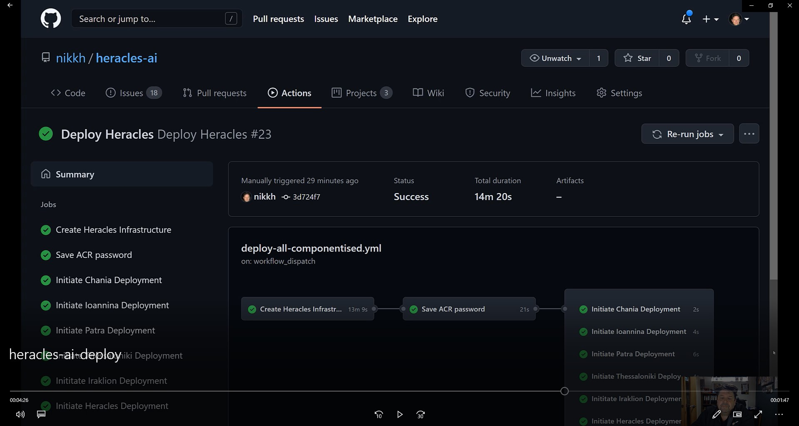

# Deploying Heracles

> Feel free to just read this site, but if you want to deploy, the best thing its to [fork this repo](https://docs.github.com/en/free-pro-team@latest/github/getting-started-with-github/fork-a-repo). Once forked, go to your copy.  Click on actions.  If you are asked click on “I Understand my workflows, go ahead and enable them”. You may need to correct a few things (such as the workflow status badges in the main readme.md). 

Deploying Heracles is easy.  Follow these simple steps:

## Create a Service Principal for GitHub Actions
The actions in this repo create all the resources necessary to run the TimeHelper application in a new resource group in one of your subscription.  In order to do that we need Azure credentials with contributor rights to the subscription where you will host. Run the following command in Azure CLI and copy the resultant json output to your clipboard

`az ad sp create-for-rbac --name "myApp" --role contributor --scopes /subscriptions/{subscription-id} --sdk-auth`

Then create GitHub secret called AZURE_CREDENTIALS and paste the json content generated above into the value field for the secret. [see here for more details](https://github.com/Azure/login#configure-deployment-credentials)

## Create Other GitHub Secrets

There are a couple of other secrets you need to define in GitHub:

### Database Admin Password

DB_ADMIN_PASSWORD=***************
This is simply the password that will be used to administer the Azure SQL Database that gets created.  Its highly unlikely you'll need to use it, but make a note of the value you choose.  It should really be 12 characters alphameric or longer.

### GitHub Personal Access Token
HERACLES_PAT=********************************
This is a Personal Access Token to allow the GitHub actions to access your repo.  This is needed to enable the main infrastructure deployment workflow to kick off deployments of the applications once it has completed normally.  Follow the instructions for [creating a GitHub PAT](https://docs.github.com/en/free-pro-team@latest/github/authenticating-to-github/creating-a-personal-access-token#:~:text=Creating%20a%20token.%201%20Verify%20your%20email%20address%2C,able%20to%20see%20the%20token%20again.%20More%20items), ensure you grant the public_repo scope and then store the value of the generated PAT as a secret.

> I dont think you actually need this.  I think instead you can directly reference ${{ secrets.GITHUB_TOKEN }} but I didn't have time to test it yet.

## Initiate Deployment

To initiate the deployment, choose the *Actions* tab at the top of the repo screen.  In the list of workflows, choose *Deploy Heracles* and on the right choose *Run Workflow*.  An invite screen will appear to capture parameters for this deployment:

  

Fill out the the parameters as follows:

### Application alias
The application alias is important. IT is used as a stem when naming the Azure resources that will be created. Choose something unique, it should be about 6 characters in length, and lower case alphameric.  For the demo instance I chose 'herc'. 
> This will be used as part of the storage account names - which have very rigorous constraints - hence the need for lower case.  

### Location
The Azure location where the resources will be deployed.  uksouth, ukwest, northeurope or any other valid Azure data centre.

### Instance Name
The instance name is stored as a tag against all resource groups.  It's important for me where I have multiple instances of the application deployed, and it let's me work with groups of resources together.  If you only plan on deploying once, leaving the Instance Name as Lucky_Jim would be fine.

### debug output?
Leave set to False.

### pending delete?
Set to False.

# Watch the Deployment Video

There is a short (6 minute) video that shows the deployment in action:

