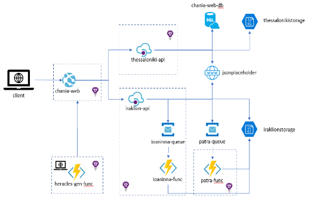

# Heracles Architecture

The Herecles architecture is intentionally quite complex.  The intent here is to demonstrate how Application Insights help you to instrument your complex applications, and "Hello World" isn't really going to cut it.

The visible web application is Chania. This is a simple aspnet core application that calls services in other APIs in order to complete the Labours of Heracles.  This web application has is own dedicated Application Insights instance.

There are two APIs:
 - thessaloniki
 - iraklion
 
Both have separate Application Insights instances. Thessaloniki is a dotnet core application running on a Windows app service. Iraklion is a dotnet core application running on app service for linux containers. Both APIs will call into [{JSON} Placeholder](https://jsonplaceholder.typicode.com/) which simulates a dependency on an external service.  Thessaloniki accesses an Azure SQL database.

Ioaninna and Patra are Azure functions that read from thier own dedicated queue populated by Iraklion.  The coe is identical, but PAtra has its own dedicated application insights instance, while Ioaninna shares the Iraklion Application insights.

Heracles is a traffic generator service.  By default, Heracles will generate traffic on a schedule, but it can also be triggered by a HTTP Get (again useful in demos).  Herecles also generates synthetic user traffic using [Selenium Webdriver](https://www.selenium.dev/) (deployed on a custom container in Azure Functions) to log onto Chania and click around the web interface.  This is useful for generating Web Analytics in Application Insights.

For more in depth descriptions of the components see [Microservice Descriptions](docs/intro/microservice-descriptions.md)
